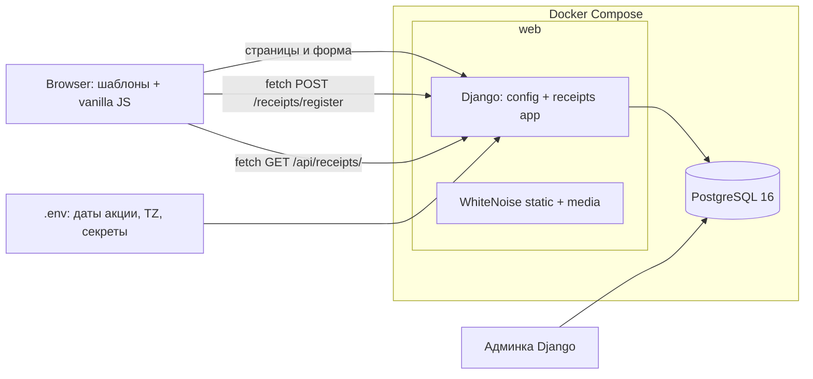

# План: промо-акция «Чек на удачу»

Тестовое задание: небольшое веб-приложение — покупатель регистрирует чек, модератор проверяет его в админке.

**Стек:** Python, Django, PostgreSQL, Docker, Django REST Framework.
**Фронтенд:** шаблоны Django + чистый JS (валидация, fetch).

---

## 1. Архитектура



### Структура проекта

```
happiness_receipt/
├── docker-compose.yml          # web + db (postgres:16-alpine), volume pgdata и media
├── Dockerfile                  # python:3.12-slim + entrypoint
├── entrypoint.sh               # ожидание БД, migrate, collectstatic, суперпользователь, gunicorn
├── requirements.txt            # Django, djangorestframework, psycopg, Pillow, python-dotenv, whitenoise, gunicorn
├── .env.example                # все переменные включая PROMO_START_DATE / PROMO_END_DATE
├── manage.py
├── config/
│   ├── settings.py             # чтение .env, DRF-настройки, TIME_ZONE=UTC, USE_TZ=True
│   └── urls.py                 # include('receipts.urls'), include(django.contrib.auth.urls)
├── receipts/
│   ├── models.py               # Receipt
│   ├── forms.py                # ReceiptForm + серверная валидация
│   ├── campaign.py             # границы периода акции из .env, часовые пояса
│   ├── views.py                # register, cabinet
│   ├── serializers.py          # DRF: ReceiptSerializer
│   ├── api_views.py            # DRF: GET /api/receipts/
│   ├── admin.py                # обязательная причина отказа, CSV-выгрузка
│   ├── qr.py                   # бонус: парсер строки t=...&s=...&fn=...&i=...&fp=...
│   ├── templates/receipts/     # base.html, register.html, cabinet.html
│   ├── static/receipts/        # style.css, register.js, cabinet.js
│   └── tests/                  # валидация чека + безопасность API
└── media/receipts/             # фото чеков (в .gitignore)
```

---

## 2. Модель `Receipt`

Поля:
- `user` — FK на `settings.AUTH_USER_MODEL`, `related_name="receipts"`
- `fn` — CharField, ровно 16 цифр (фискальный номер)
- `fd` — CharField, до 10 цифр (фискальный документ)
- `fp` — CharField, до 10 цифр (фискальный признак)
- `purchased_at` — DateTimeField (дата и время покупки, хранится в UTC)
- `amount` — DecimalField(max_digits=10, decimal_places=2)
- `status` — TextChoices: `pending` / `accepted` / `rejected`, default `pending`, db_index
- `rejection_reason` — TextField, blank
- `photo` — ImageField(upload_to="receipts/%Y/%m/", blank=True, null=True) — бонус
- `created_at` — auto_now_add

Meta:
- `ordering = ["-created_at"]`
- Частичный уникальный индекс: `UniqueConstraint(fields=["fn","fd","fp"], condition=Q(status__in=[pending, accepted]), name="unique_active_receipt")`

**Назначение индекса:** дубликат «живого» чека (на проверке/принят) блокируется на уровне БД (защита от гонки одновременных запросов). Отклонённый чек можно подать повторно — старый остаётся в истории как отклонённый. При `IntegrityError` во view пользователь получает понятное сообщение, а не 500.

---

## 3. Период акции из .env (`campaign.py`)

Переменные:
- `PROMO_START_DATE` — дата начала (например `2026-10-01`)
- `PROMO_END_DATE` — дата окончания (например `2026-10-31`)
- `PROMO_TIMEZONE` — часовой пояс акции (например `Asia/Novosibirsk`)

Функции модуля:
- `campaign_start()` — aware datetime: начало первого дня в `PROMO_TIMEZONE`
- `campaign_end()` — aware datetime: конец последнего дня (23:59:59.999999) в `PROMO_TIMEZONE`
- `is_within_campaign(purchased_at)` — bool
- `campaign_period_display()` — строки для шаблонов (даты выводятся с экрана страницы из настроек)

Введённое пользователем время покупки трактуется как местное время акции (`PROMO_TIMEZONE`) и конвертируется в UTC для хранения. Сравнение с границами — в UTC.

---

## 4. Форма и серверная валидация (`forms.py`)

`ReceiptForm(ModelForm)` с полями: fn, fd, fp, purchased_at (datetime-local), amount, photo (необязательно), qr_line (необязательно, бонус — не сохраняется).

Валидация:
- **Формат реквизитов:** ФН ровно 16 цифр, ФД и ФП — только цифры (regex-валидаторы)
- **Сумма:** ≥ 1000 ₽ (`MinValueValidator`)
- **Дата покупки:** внутри периода акции; также отклоняем «чек из будущего» (покупка позже текущего момента в `PROMO_TIMEZONE`)
- **Уникальность ФН+ФД+ФП:** проверка в `clean()` с человекочитаемым сообщением «Этот чек уже зарегистрирован»; дубликат допустим только если существующий чек отклонён
- **Статус:** всегда `pending` при создании (пользователь не может передать статус)

Обработка формы:
- Обычный POST — редирект на кабинет
- Запрос через `fetch` — ответ JSON: `{ok: true}` или `{ok: false, errors: {field: msg}, non_field_errors: [...]}`
- Перехват `IntegrityError` (гонка дубликатов) → JSON/сообщение «Этот чек уже зарегистрирован», без 500

---

## 5. Представления и маршруты

| URL | Назначение |
|---|---|
| `/` | Редирект: авторизован → кабинет, иначе → login |
| `/receipts/register/` | Форма регистрации чека (login_required) |
| `/receipts/` | Личный кабинет: свои чеки, новые → старые, пагинация по 10, кнопка «Зарегистрировать чек» |
| `/api/receipts/` | DRF: GET — чеки текущего пользователя в JSON |
| `/accounts/...` | `django.contrib.auth.urls` (дефолтные шаблоны, без вёрстки) |

---

## 6. API на DRF (`api_views.py`, `serializers.py`)

- `ReceiptSerializer`: id, fn, fd, fp, purchased_at, amount, status, rejection_reason, created_at, photo
- `ReceiptListAPIView(generics.ListAPIView)`:
  - `permission_classes = [IsAuthenticated]`
  - `get_queryset()` всегда `Receipt.objects.filter(user=self.request.user).order_by("-created_at")` — чужие чеки не вернутся ни при каких параметрах запроса
  - Любые query-параметры (например `user_id`, `id`) игнорируются — в queryset они не попадают; поддержан только опциональный `page` для пагинации
- Поддержка пагинации DRF (PageNumberPagination, 10 на страницу) — используется фронтендом для автообновления статусов
- DRF-настройки: SessionAuthentication, JSON renderer, русские сообщения

---

## 7. Админка (`admin.py`)

- `ReceiptAdmin`: list_display (user, fn, fd, fp, amount, status, purchased_at, created_at), list_filter (status, даты), search (fn, fd, fp, username)
- В форме: при статусе `rejected` причина обязательна; при смене на `pending`/`accepted` причина очищается
- Action «Выгрузить принятые чеки в CSV»: только `accepted`, BOM для Excel, колонки user/fn/fd/fp/purchased_at/amount/status/reason/created_at
- Бонус: превью фото в списке/форме

---

## 8. Фронтенд

Два экрана по макету Figma (описание макета уточняется): регистрация чека и личный кабинет.

- Шапка: название акции, период акции из настроек, имя пользователя, выход
- Регистрация: поля формы + подсказки, клиентская валидация (обязательные поля, форматы цифр, дата в периоде, сумма ≥ 1000), ошибки подсвечиваются рядом с полями без перезагрузки
- Отправка через `fetch` с CSRF-токеном; успех — зелёный баннер, ошибка — красный; ответ сервера показывается на странице
- Кабинет: таблица чеков (дата покупки, сумма, статус, причина отказа), пагинация по 10, кнопка «Зарегистрировать чек»
- Адаптив: на 375px таблица превращается в карточки, ничего не разъезжается, нет горизонтального скролла
- Чистый JS без фреймворков

---

## 9. Docker и инфраструктура

- `docker-compose.yml`: сервис `db` (postgres:16-alpine, healthcheck, volume pgdata) + сервис `web` (build ., env_file .env, ports 8000:8000, depends_on healthy, volume media)
- `Dockerfile`: python:3.12-slim, установка зависимостей, сборка static
- `entrypoint.sh`: ожидание готовности БД → `migrate` → `collectstatic --noinput` → создание суперпользователя из env (если задан, идемпотентно) → `gunicorn config.wsgi:application`
- Static через WhiteNoise, media — через volume и Django (DEBUG)
- `.env.example`: DEBUG, SECRET_KEY, ALLOWED_HOSTS, CSRF_TRUSTED_ORIGINS, DB_*, PROMO_START_DATE, PROMO_END_DATE, PROMO_TIMEZONE, LANGUAGE_CODE=ru, TIME_ZONE, DJANGO_SUPERUSER_*
- Реальные секреты в репозиторий не коммитим (.env в .gitignore)
- Git: осмысленная история коммитов, не один «init»

---

## 10. Спорные решения (будут описаны в README)

1. **Границы периода акции:** задаются датами в `PROMO_TIMEZONE` (пояс акции), а не в поясе покупателя — у акции одна граница; введённое время покупки трактуем как время акции и храним в UTC
2. **Повторная регистрация отклонённого чека:** разрешена (частичный уникальный индекс), «живые» дубликаты заблокированы на уровне БД
3. **Причина отказа:** обязательна только при статусе «отклонён», очищается при возврате в другой статус
4. **Формат ФП:** до 10 цифр (стандарт ФНС для QR-кодов чеков)
5. **«Чек из будущего»:** отклоняется как невозможный
6. **API:** любые посторонние query-параметры игнорируются, фильтрация всегда жёстко по `request.user`

---

## 11. Бонусы сверх задания

- [x] тесты на валидацию чека и безопасность API (планируется)
- [x] поле «вставить строку из QR-кода»: парсер `t=...&s=...&fn=...&i=...&fp=...` + автозаполнение формы (планируется)
- [x] загрузка фото чека с проверкой формата и размера (планируется)
- [x] статус в кабинете обновляется без перезагрузки через polling `/api/receipts/` (планируется)
- [x] выгрузка принятых чеков в CSV из админки (планируется)

---

## 12. Тесты (`receipts/tests/`)

- Валидация: сумма < 1000, дата вне периода, дубликат ФН+ФД+ФП (в т.ч. между разными пользователями), повторная подача отклонённого, новый чек всегда pending
- QR-парсер: корректная строка, мусор, отсутствующие параметры
- API: неавторизованный → 403, свои чеки видны, чужие недоступны даже с параметрами `user_id`/`id`
- Форма: ошибки отображаются по полям

---

## 13. README

Разделы: описание, стек, как запустить (docker compose up, суперпользователь, демо-данные), что сделано, спорные решения, что сверх задания, что не успели, «Работа с ИИ» (где помог ИИ, что выдал неправильно и как это заметили, что переписали бы при большем времени).

---

## 14. Порядок работ

1. Инициализация Django-проекта, зависимости (включая DRF), настройки, `.env.example`, `.gitignore`
2. Docker: Dockerfile, docker-compose, entrypoint
3. Модель `Receipt` + миграции
4. `campaign.py` + `forms.py` (серверная валидация)
5. Views: register, cabinet + urls
6. DRF: serializer + api_views + urls
7. Админка: статусы, причина отказа, CSV
8. Фронтенд: шаблоны, CSS (по макету), адаптив
9. JS: валидация, fetch, QR-парсер, автообновление статусов
10. Тесты
11. README
12. Проверка end-to-end через docker compose up